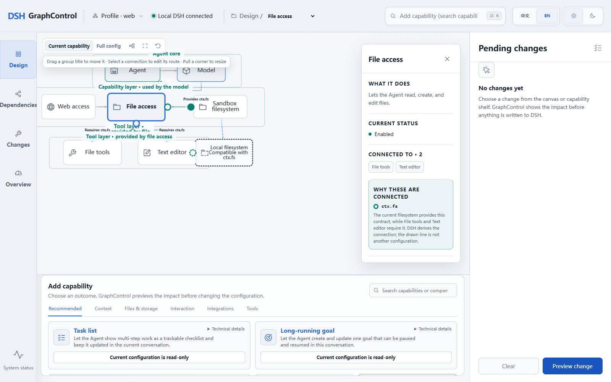

# DSH GraphControl

[English](README.md) | 简体中文

**用于理解和配置 DeepSeek Harness 的本地可视化控制台。**

[](https://github.com/CebCai/dsh-graph-control/actions/workflows/ci.yml)



> 早期预览：GraphControl 目前从源码运行，只支持一组边界明确的配置修改。尚未支持的官方 DSH 数据仍会显示，但保持只读。

GraphControl 将本地 [DeepSeek Harness](https://github.com/deepseek-ai/deepseek-harness) 配置转换为可探索的能力图，帮助你理解 Provider 和依赖关系、准备受支持的修改、预览影响，并在明确确认后应用。官方 DSH 始终是配置语义的唯一来源。

GraphControl 是独立项目，与 DeepSeek 无隶属或背书关系。

## 当前可以做什么

- 将官方 DSH Profile 查看为能力图和依赖图。
- 检查 Provider、消费者、配置来源和执行边界。
- 预览受支持的组件、文件系统 Provider、目录、Time、Schedule、会话工具和 MCP HTTP 修改。
- 在写入前集中检查待应用修改和依赖冲突。
- 确认后修改一个 Profile Patch，并立即重新读取官方组合结果。
- 打开或切换本地 Profile；缺少内置 `web` Profile 时可走受保护的初始化流程。
- 在中文和英文、浅色和深色界面之间切换。

## 项目状态

GraphControl 目前是源码预览，并未发布为可通过 `dsh plugin` 安装的 Bundle。同源启动模式只会为当前进程加载一个临时启动 Overlay，不会把 UI Bundle 安装进所选 Profile；进程停止后该挂载即消失。

DeepSeek Harness 本身也处于开发者预览阶段，可能发生不兼容变更。运行项目前请阅读[官方 DSH 文档](https://deepseek-harness.github.io/deepseek-harness/)和安全说明。

当前限制：

- 只支持上文列出的组件族编辑，尚不能进行任意自由组合。
- 不能创建任意自定义 Profile，也不能修复或迁移已有 Profile。
- 此源码预览不包含实时运行观测、远程执行或 Harness 优化。
- 目前没有安装器、npm 包或正式 DSH Bundle。

## 运行要求

- Windows x64 与 PowerShell
- Git
- Node.js `^22.19.0` 或 `>=24.0.0`
- Corepack
- 一个本地 DSH Home；也可以提供一个目录，再由 GraphControl 初始化缺失的内置 `web` Profile

## 快速开始

克隆仓库、安装工作区，并准备官方最新发布的 DSH 版本：

```powershell
git clone https://github.com/CebCai/dsh-graph-control.git
Set-Location dsh-graph-control
corepack enable
corepack pnpm install --frozen-lockfile
corepack pnpm dsh:bootstrap
```

指定 DSH Home，并让 GraphControl 与 DSH Web 运行在同一个本地 Origin：

```powershell
$env:DSH_HOME = 'C:\path\to\your\dsh-home'
corepack pnpm studio:official
```

先打开终端中输出的 DSH 启动链接，再打开随后输出的 `/harness-studio/` 链接。两个服务都只监听本机回环地址。

如果内置 `web` Profile 尚未初始化，或者需要脱离 DSH Web 外壳进行前端开发，可启动独立控制台：

```powershell
$env:DSH_HOME = 'C:\path\to\your\dsh-home'
corepack pnpm studio
```

独立控制台默认位于 `http://127.0.0.1:4317`。无论初始化还是配置写入，都必须先 Preview，再由用户明确 Apply。

## 安全模型

- 官方 DSH 配置与组合结果始终权威。
- 控制平面只监听本机回环地址。
- 受支持的修改会保留无关源码、注释、顺序、别名、换行方式和 `!!js` 表达式。
- GraphControl 永远不会执行 `!!js`。
- 如果所选源文件在 Preview 后发生变化，写入会被拒绝。
- 对未知或含义不明确的官方配置，系统只展示，不虚构编辑能力。

漏洞报告方式和运行时信任边界见 [SECURITY.md](SECURITY.md)。

## 兼容性

`pnpm dsh:bootstrap` 每次都会解析 DeepSeek Harness 官方仓库最新发布的版本，包括预发布版本，而不是使用永久固定的旧版回退。当前源码预览已在 [`dsh-v0.1.2-alpha.2`](https://github.com/deepseek-ai/deepseek-harness/releases/tag/dsh-v0.1.2-alpha.2) 上完成验证。

所有快速变化的上游行为都集中在 `packages/dsh-adapter`，因此官方 DSH 变化时，只需更新最小的受影响边界。

## 仓库结构

| 路径 | 用途 |
| --- | --- |
| `apps/studio` | 可视化控制台与本地 Host |
| `apps/cli` | 维护者检查和受支持的直接编辑命令 |
| `packages/dsh-adapter` | 官方 DSH 发现、组合和定向写入 |
| `packages/harness-graph` | 控制台使用的派生图视图 |
| `packages/constraint-engine` | 受支持操作的依赖影响 |
| `packages/profile-edit` | Preview 与 Apply 用例 |
| `packages/edit-transaction` | 源文件变更检测和原子替换 |

设计边界见 [Architecture](docs/ARCHITECTURE.md)，参与贡献见 [CONTRIBUTING.md](CONTRIBUTING.md)。

## 许可证

[MIT](LICENSE)
